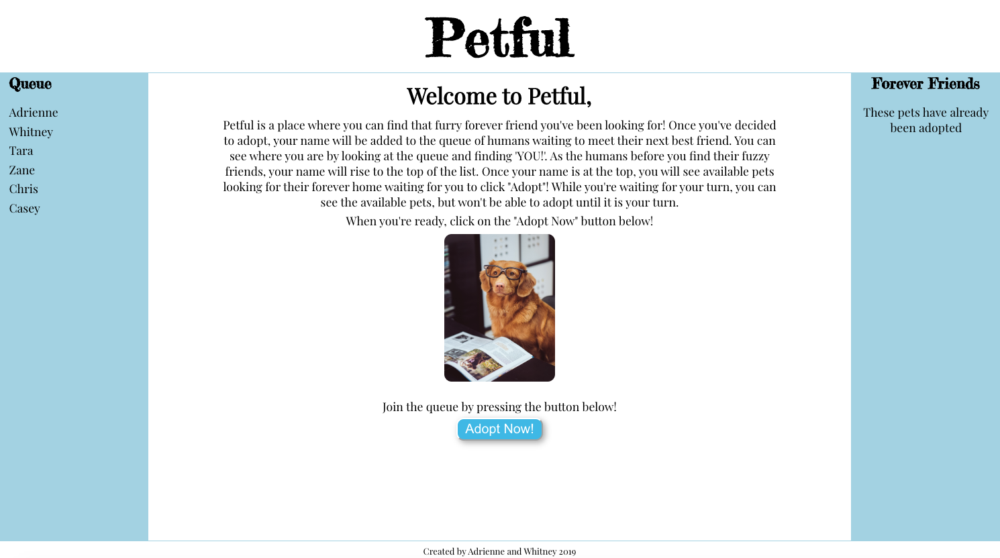
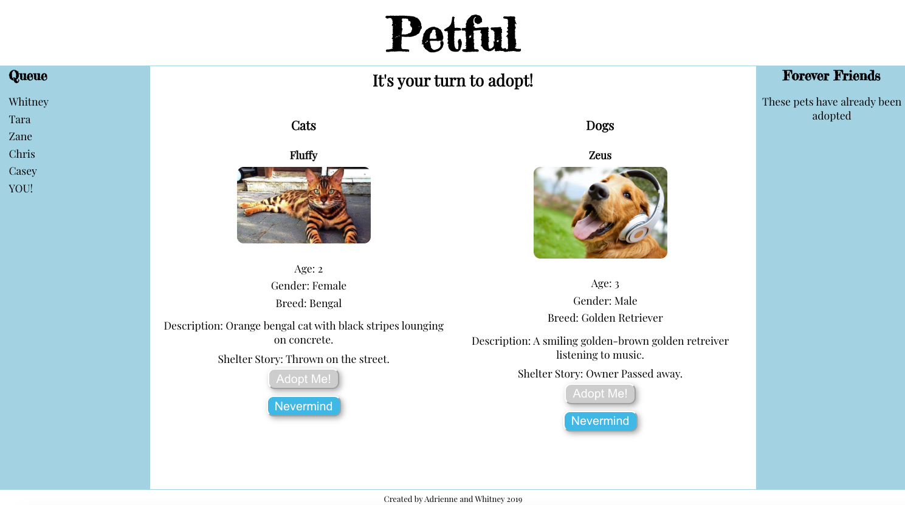
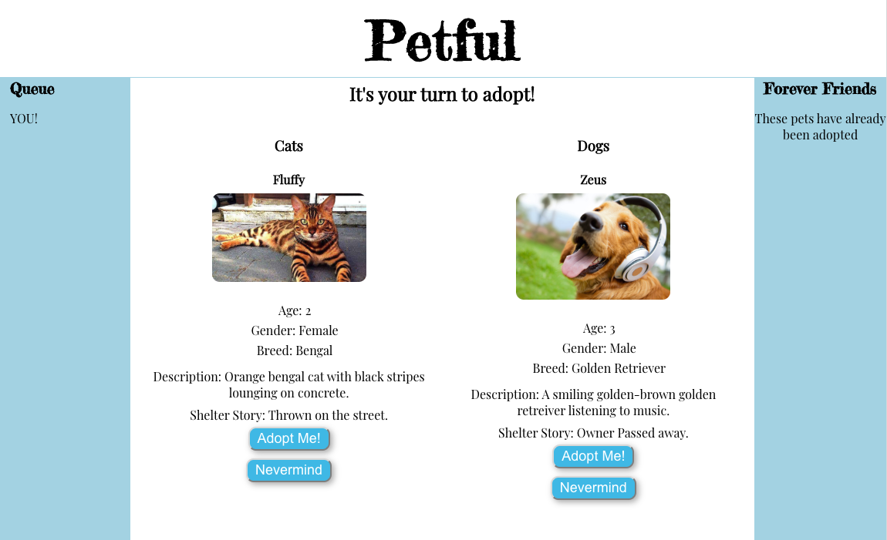
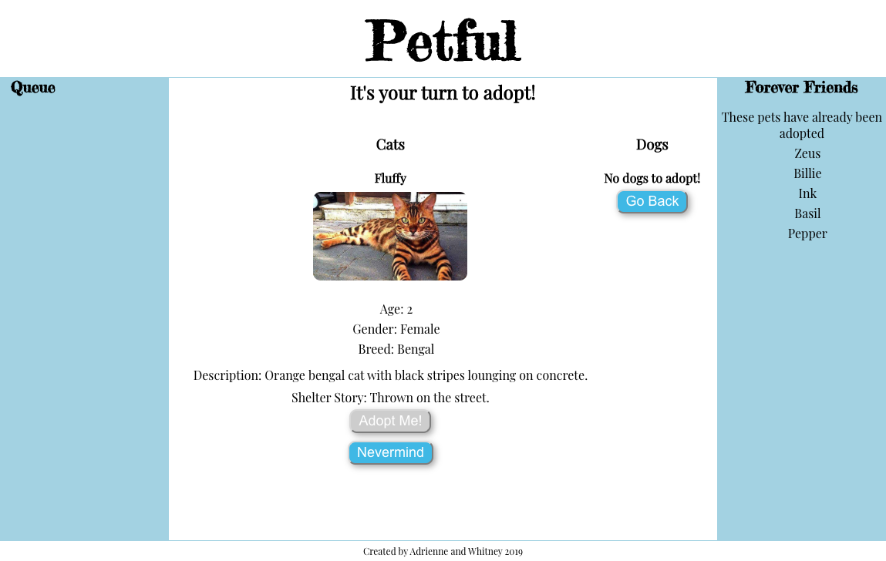

# PETFUL

## Summary
Petful is an app that utilizes the Queue data structure to create a FIFO (First In First Out) system for adopting pets.  Once a user clicks `Adopt Now`, they will be added to the queue, which can be monitored in real time on the right sidebar.  Pets that have already been adopted appear on the left sidebar.  The user may view the cat and dog currently up for adoption, but may not start adopting until it is their turn.  On their turn, the `Adopt` buttons will become enabled and allows the user to adopt as many pets as they wish in 15 seconds, as long as they adopt the current available pets.  Users also have the option of clicking `Nevermind` to return to the home page.  If no cats or no dogs, or no pets are available for adoption, a message will display and users can click the button to navigate back to the home page.

Live Link: [Petful App](https://w-a-petful.now.sh)

## Screenshots
- Landing Page

- Adoption Page

- Your Turn to Adopt!

- After Adoption

## API Documentation
`/api/cats`
* GET -> Gets current cat at the front of the queue
* DELETE -> Deletes current cat at the front of the queue

`/api/dogs`
* GET -> Gets current dog at the front of the queue
* DELETE -> Deletes current dog at the end of the queue

`/api/users`
* GET -> Gets all users in the queue
* POST -> Adds users to the end of the queue
* DELETE -> Deletes the user at the front of the queue

## Technology/Frameworks Used:

* HTML
* CSS
* JavaScript
* React
* Express
* Node.js
* Zeit
* Heroku
* Git
* GitHub
* Visual Studio Code
* Postman

## Installation:

### [Petful Server](https://github.com/thinkful-ei-emu/petful-server-adrienne-whitney)
* Install dependencies: `npm install`
* Prepare environment file: `.env`
* Start server with `npm start`

### [Petful Client](https://github.com/thinkful-ei-emu/Adrienne-Whitney-Petful-Client)
* Install dependencies: `npm install`
* Start app with `npm start`

## Credits:
Created by Adrienne and Whitney

:)
